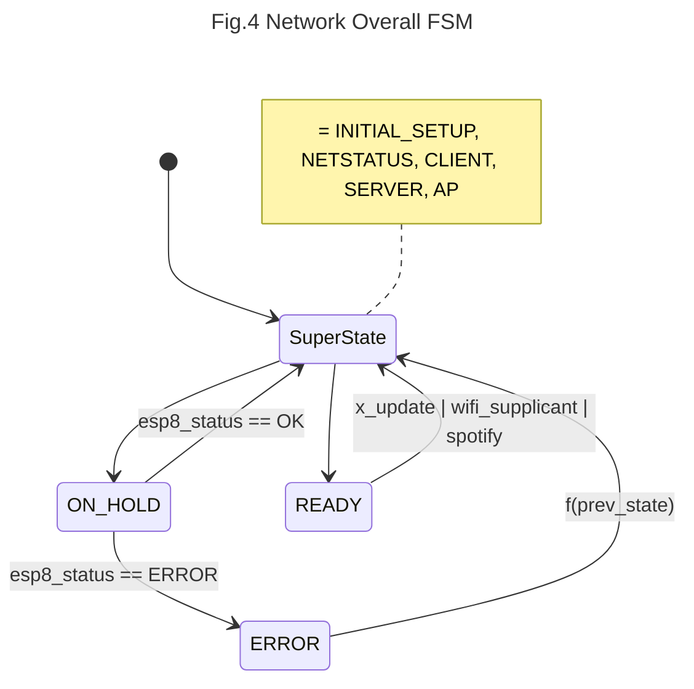

# ErikaOs-OnlineWeatherStation


It's a tiny monitor for local weather and music player, meaning, it shows the current temperature, the feeling like temperature, the temperature description and the time of request, as for the music, the artist and track that are currently being played on your Spotify player (_disclaimer_: it does not play or pause the track). The weather information is fetched from [OpenWeatherMap.org](openweathermap.org) using location from [IP-API.com](ip-api.com). In case of [Spotify](https://developer.spotify.com/), it fetches the code for the app and token (with refreshment once it's expired, 3600 s).

Two web servers were built as well, (1) the WiFi supplicant that allows the user to connect to any Access Point and (2) the Spotify Authenticator to link a Spotify account. These servers run in different modes of the WiFi module, when as a supplicant, the module works as SoftAP and station so, the user can join the WiFi network **Erika Weather**, browse to [http://192.168.4.1/](http://192.168.4.1) and set the SSID and password of the desired network and wait for connection. As Spotify Authenticator, recommended to use only when there's an internet connection, browse to [http://the-esp8266-ip/spotify](), and this this provides the link that will authenticate the user's Spotify account and later it will automatically fetch the token.   

You can skip this documentation and jump straight to the [compilation](#Compile) section.

## Hardware 

The main board is a _STM32f407-discovery_ using _std_ library mounted over a _discover-more_ extension with an LCD _LCD35RT_. The secondary board is an ESP8266 that interfaces through UART in the COM1 (USART6 on the _discovery_ PC6-PC7 pins) on the _std_ library. ESP8266's reset/GPIO0/GIPO2/Enable pin are fixed voltage, meaning they are not connected to any STM32's GPIOS.

## Firmware

On the secondary board, ESP8266, the _ESP8266-IDF-ATV2.2.1.0_ is running, provided by Espressif, you can find in [this link](https://gist.github.com/ckevar/4275573daf5d2d4803346ab56bf4e0fe) how to install this firmware on the ESP8266. This firmware version is important in order to establish SSL connections, the ATv1.6.x supports SSL, but from tests, it's seen that [*.spotify.com:443]() is virtually hosted on Google, so the SSL uses SNI and the ATv1.6.x does not support SNI.

---

In the main board, the app was built based on ErikaRTOSv2, which is divided in 6 periodic tasks (code: _inc/erika_task_conf.h_): Weather Update, Spotify Update, ESP8266 Poll, LCD In and Network.

- __Weather Update__

  Based on the OpenWeatherMap's [API doc](https://openweathermap.org/api/one-call-3) the data is updated every 10 minutes , so this task has a __10 minutes period__ that triggers an internal event invoking a change in the client of the task _Network_ to update the weather information, this closes the SSL connection (if open) for Spotify. 

  _code: src/app.c_

    

- __Spotify Update__

  Triggered each __2s__, it triggers an internal event that invokes a change in the client of the task _Network_ in order to fetch the Spotify player information.  Once the token is acquired, the automaton of the network on the STM32 requests a SSL connection to [api.spotify.com:443](https://api.spotify.com) and it does not close it until a _weather update_ event asks for weather information. This link remains open due to establishing a SSL connection takes ~5 seconds on the ESP8266. Keep in mind that Spotify sends minimum 7Kbytes of HTTP data (1Kbyte: HTTP header + 6Kbyte: JSON) when a track is being played, note as well that there are songs that can reach 13Kbytes, transmitting these data and parsing it takes ~2 seconds. So, if the goal is to fetch the most recent information from the player open and closing the SSL connection is not the most suitable option, moreover, open and closing creates an overhead in the ESP8266 and in the Spotify's servers (which I don't think it's a big deal but if it were a smaller server, it would be a different story).

  In order to reduce the amount of data coming from Spotify, the query request has being modified, so instead of being only:

  ```bash
  GET api.spotify.com/v1/me/player/currently-playing
  ```

  the available market was placed

  ```bash
  GET api.spotify.com/v1/me/player/currently-playing?market=IT # IT stands for Italy
  ```

  This request decreased the data size down to ~4Kbytes (1KByte: HTTP Header + 3Kbyte: JSON).

  _code: src/app.c_

  

- __ESP8266 Poll__

  Triggered each __40 ms__, parses the incoming data of the ESP8266. 40ms has being chosen because initially the circular buffer where the DMA is placing the incoming UART data was 1024 bytes size, and at 115200 bauds with 1 start bit  and 1 end bit of the UART, 10240 bits will fill the buffer in 88ms, to avoid overlapping data, it's better to empty the buffer as soon as possible,  so (by Nyquist) 40ms will do the job. that buffer dimension works perfect when fetching weather information because the data barely reaches 1Kbytes. It's a different story for Spotify where sometimes it throws 13Kbytes for a song. So, the initial buffer dimension isn't enough. But choosing a larger period will make other procedures slower, like when setting up the ESP8266, the used commands are averagely 14 bytes size (~1.2ms to transmit). So, the current mechanism does not try to empty the buffer but just wait for the content of the HTTP, the header is almost discarded, the only fields of interest are the _HTTP Method_, the _HTTP Status Code_ and the _Content-Length_. Right now the buffer size is 8Kbytes and 40ms works perfectly.

   _code: src/esp8266_driver.c_

- __LCD In__

  Triggered each 20 ms, it checks if the LCD has being touched. An event-triggered filter was implemented in order to reduce the noise of the coordinates when the panel gets touched. The figure Fig.1 shows the x axis pixels upon touching the Spotify Icon button for 10.24 seconds (512 samples). As seen the x-axis data ranges from 200px to 280px,  falling only 211 samples  within the icon's dimension out of the 512 samples.
<br><br>
  
<br><br>
  Some noise can be allowed whilst the double of standard deviation is as smaller as the button's dimension, in this case a button covers 30x30 pixels and the standard deviations of the touchscreen are the followings for each axis:

  $$\sigma_x = 22.88px, \sigma_y = 3.98px$$
  
  Y-axis doesn't need a filter as long as the touched coordinate is close to centre of the button, while the x-axis does need to be filtered.

  There's an [application report](https://www.ti.com/lit/an/sbaa155a/sbaa155a.pdf?ts=1717523545771&ref_url=https%253A%252F%252Fwww.ti.com%252Fproduct%252FTSC2046E%253FkeyMatch%253DTSC2046EIRGVR%2526tisearch%253Dsearch-everything%2526usecase%253DOPN-ALT) by W. Fang where 4 non linear filters are suggested for resistive touchscreens: 

  - Average with _N = 4_  samples.

  - Weighted Average with _N = 4_ samples and _M = 2_ (meaning drop 2 samples).

  - Middle Value with _N = 3_ samples.

  - Average the closest with _N = 3_ samples.

  They were all tested using the raw data from Fig.1 and the results are shown in Fig.2. Two additional filters were explored, the [State Update Equation](https://www.kalmanfilter.net/alphabeta.html) _(1)_ with a fixed $\alpha$ and another _(2)_ with $\alpha(t)$:

  $$\hat{x} _{n,n}=\hat{x} _{n,n-1} + \alpha (z _n - \hat{x} _{n,n-1}) \space\space\space\space(1)$$
  
  and
  
  $$\hat{x} _{n,n} =\hat{x} _{n,n-1} + \alpha(t)(z _n - \hat{x} _{n,n-1}) \space\space\space\space(2)$$

$$\alpha(t) = \alpha_1+\frac{\alpha_0-\alpha_1}{\sigma t + 1} | \alpha_0>\alpha_1>0  \land  \sigma > 0 \space\space\space(3)$$

  

  

  In Fig.2, only a small window frame of 250ms is shown because pushing a button takes less than 1 second, so the purpose is to see which filter is the fastest one; since all filters kept the signal within the range of the button. Filters such as _Weighted Average_ and _Averaging the Closest_ are operating on the boundaries, discarded. On the other hand _State Update_ is the slowest among all, discarded as well, however _State Update_ with $\alpha(t)$ takes the signal to the button region in the second samples (20ms).

  This _State Update Equation (2)_ with a variable $\alpha$ is quite similar to a Kalman Filter, but, instead of $\alpha$ depending on the variance of the process and the measure, it only leads $\alpha_0$ to become $\alpha_1$ at the rate of $\sigma$ (_+1_ is to avoid division by zero). This is due that a large $\alpha$ has a fast response but performs poorly at removing noise (used when touched) while a small $\alpha$ performs good at removing noise but is really slow, so the idea behind it is to change $\alpha$ over time so the signal reaches the desired level as soon as possible and then removes the noise.  This is implemented in a way that the $t$ gets resetted when there's a touch:

  ```c
    1 #define ALPHA10_X   5.799 // alpha1 - alpha0        
    2 #define ALPHA1_X    0.001
    3 #define SIGMA_X     260.0
    4 #define DELTA_T     0.02
    5
    6 static void state_update_extended(int *x, uint8_t *trigger) {
    7     static int16_t x_estimated = 0;
    8     static float t = 0.0;
    9     float alpha_x;
   10
   11     if (*trigger) {                 
   12         t = t + DELTA_T;
   13     } else {
   14         t = 0.0;     
   15         x_estimated = 0; 
   16     }
   17                     
   18     *trigger = 1;
   19
   20     alpha_x = ALPHA1_X + ALPHA10_X / (SIGMA_X * t + 1.0);   
   21     x_estimated = x_estimated + alpha_x * (*x - x_estimated);
   22     *x = (int) x_estimated;
   23 } 
  ```

  $$\alpha_0 = 5.8,\alpha_1 = 0.001, \sigma=260 $$

  

  

- __Network__

  Triggered each 80ms, runs the web client or the web servers upon request of the previous tasks or external events as seen in the flow diagram on Fig.3. the external events are spotify_setup and wifi_setup, they are button in the touchscreen and are used to link a spotify account and to join to an Access Point respectively. On the other hand the internal events are generated by the tasks Weather Update and Spotify Update. 

  ```mermaid
  ---
  title: 'Fig.3 Flow diagram of task Network'
  ---
  flowchart TD
  
  Start --> settings
  settings --> fetch_location
  fetch_location --> fetch_weather
  fetch_weather --> token{spotify_token?}
  ERROR --> settings
  
  token -- no --> code{spotify_code?}
  token -- yes --> fetch_spotify_player
  
  code -- yes --> fetch_spotify_token
  code -- no --> Ready
  
  fetch_spotify_token --> fetch_spotify_player
  fetch_spotify_player --> http_code{HTTP200? HTTP401?}
  
  http_code -- HTTP200 --> fetch_spotify_player
  http_code -- HTTP401 --> fetch_spotify_token
  http_code -- else --> ERROR
  
  
  Ready --> Ready
  update_weather --> ready{ready?}
  ready -- yes & update_weather --> fetch_location
  ready -- yes & update_spotify --> fetch_spotify_player
  update_spotify --> ready
  
  spotify_setup --> ready
  ready -- yes & spotify_setup --> spoty_server
  
  wifi_setup --> ready
  ready -- yes & wifi_setup --> enable_AP
  enable_AP --> wifi_supplicant
  ```
  
  Even though Fig.3 shows the flow diagram of the app within network, the network task itself is set of 9 states that are sketched in Fig. 4. These states are in charge of setting up the device, connecting to the web clients and serving the interfaces for spotify set up and wifi supplicant. These series of steps are executed by sending AT commands to the ESP8266 and wait and based on that response, move over the states. These states are:
  
  - Superstate INITIAL_SETUP, it has 5 substates: _RESTART_, _CHECK_DEV_, _STATION_MODE_, and _MULTI_CON_.
  - Superstate NETSTATUS, it has 3 substates: _IFCONFIG_, _NETSTAT_, and _NETKILL_
  - Superstate CLIENT, it has 7 substates: _CONNECT_SSL_, _CONNECT_TCP_, _RMALLOC_, _CWRITE_, _CREAD_, _CLOSE_, and _DONE_
  - Superstate AP, it has 3 substates: _RESTART_4AP_, _ENABLE_AP_, and _SET_AP_CREDENTIALS_. AP stands for Access Point.
  - Superstate SERVER, it has 8 substates: _MULTI_CONN_AP_, _SERVER_ON_, _LISTENING_, _SREAD_, _RMALLOC_S, _SWRITE_, _PURGE_BUFF_, and _SERVER_OFF_.
  - ON_HOLD, fetches _esp8_status_ and moves the state according to a LUT of the previous state.
  - READY, idle state, waits for a connection request.
  - ERROR, moves the state according to a LUT of the previous state.
  - SET_STA_CREDENTIALS, dummy state to set the credentials of an Access Point to be joined.
  
  Upon implementation, the state is represented by a single _uint16_t_ (linux-dev inspired):
  
  ```c
    1 #define SUBSTATEBITS        6   
    2 #define SUBSTATEMASK        ((1u << SUBSTATEBITS) - 1)
    3 #define MKSTATE(super, sub) ((sub << SUBSTATEBITS) | (super & SUBSTATEMASK))
    4 #define SUBSTATE(state)     (state >> SUBSTATEBITS)
    5 #define SUPERSTATE(state)   (state & SUBSTATEMASK)
  ```
  
  So, in order to address a state:
  
  ```c 
  state->nx_state = MKSTATE(ESP8SS_CLIENT, ESP8S_CONNECT_SSL);
  state->nx_state = MKSTATE(ESP8SS_ON_HOLD, 0);
  ```
  
  As said, knowing the previous state is important in order to move the process, that's why a structure holds the states:
  
  ```c
    1 struct StateS {            
    2     uint16_t *nx_state;   // Next State 
    3     uint16_t *state;      // Previous State
    4     uint8_t *timeout;     // Loop count spent in a single state
    5     int8_t *wifi_mode;
    6 };  
  ```
  
  This structure then is passed to all states that can change the state.
  
   



Unlike other superstates, Client and Server state have a _client_function_ and _Server_function_ that allows choosing the client and/or the server based either on internal or external events. The spotify button creates a TCP server in station mode inside the ESP8266 and serves a link in a browser to allow the user connect a spotify account. the setting button switches the ESP8266 to a SoftAP + station mode and serves a minimal UI that allows the user to insert a SSID and password of Access Point to join. As for the web clients, there are 4 clients:

- Location, fetches from IP-API the latitude and longitude.
- Weather, fetches from OpenWeatherMap the current weather.
- Spotify Auth, fetches a token or a renewal of it.
- Spotify Player, fetches the current player state. 

The relationship between theses clients and when or how the servers are enabled are shown in Fig.3.

## Run and flash it
if the hardware is ready, The file _c_mX.bin_ can be flashed as follows:
``` bash
$ st-flash write c_mX.bin 0x8000000
```

## Compile
In order to recompile you need to download ERIKA2.x-OS from https://www.erika-enterprise.com/index.php/download/erika-v2.x.html
Once Erika is install, you only need the Erika-CLI not the whole Eclipse to work. So, everything useful executable you need is under the _evidence_ folder.

### Step 1
Generate files from configuration file _conf.oil_ 

``` bash
$ erika-gen /path/where/Erika-CLI/is/installed/Erika-CLI/ conf.oil .
```

### step 1
add _usr.mk_ inside makefile

``` bash
$ nano makefile
```
in the first line write:

``` bash
$ include usr.mk
```
## step 3
You also need to install _gcc-arm-none-eabi_.
Edit usr.mk, to address where the gcc-arm-none-eabi compiler is installed
``` bash
$ nano usr.mk
```

Locate the line that starts with _GNU_ARM_ROOT_ and change it by the path where your compiler is installed.

## Requirements
- ESP8266-IDF-ATV2.2.1 firmware
- Erika2.x OS (the operating system of the board)
- gcc-arm-none-eabi (to compile the project)
- stlink (to flash the board)

