# ErikaOs-OnlineWeatherStation
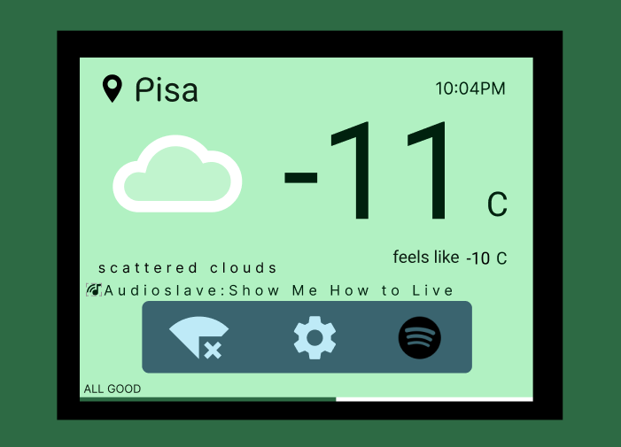

## 1. Requirements 

This briefs the requirements as a main goal of the project. The diagrams and state flows presented in the following documentation are extensions and/or refinements of the main goal and the approaches taken in order to comply such a goal, which is:

​	_Displaying the current weather and the current Spotify playback status._   

Such information shall be acquired from the internet using free available APIs, thus the system shall provide:

​	_WebUI for the user to setup the WiFi credentials of a network and another to grant the Spotify permissions to access the playback status_.

## 2. Approach

You can skip this documentation and jump straight to the [compilation](#Compile) section.

### Hardware 

The main board is a _STM32f407-discovery_ using _std_ library mounted over a _discover-more_ extension board with an LCD _LCD35RT_. The secondary board is an ESP8266 that interfaces through UART in the COM1 (USART6 on the _discovery_ PC6-PC7 pins) on the _std_ library. ESP8266's reset/GPIO0/GIPO2/Enable pin are fixed voltage, meaning they are not connected to any STM32's GPIOS. In _Graph 1_, the interfaces among hardware components are shown.

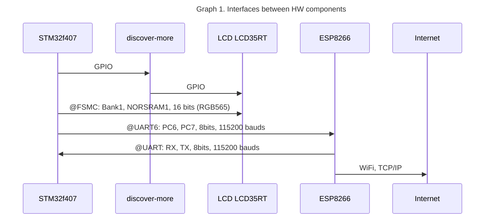

### Firmware 

The weather information is fetched from [OpenWeatherMap.org](openweathermap.org) using the location from [IP-API.com](ip-api.com). In case of [Spotify](https://developer.spotify.com/), it's a procedure that starts from fetching the _OAuth code_ for the app and token (supports token refreshment) and the pull the playback status. The design of the system can be seen as an automated web browser that stacks network management, API requests and web servers.

***Additional Firmware notes***

Before diving into the core components of the system, let's take briefly a look on the secondary board, ESP8266. The firmware running is the _ESP8266-IDF-ATV2.2.1.0_, provided by Espressif, which I uploaded it [here](https://gist.github.com/ckevar/4275573daf5d2d4803346ab56bf4e0fe), along side a tutorial how to install it. This version is essential in order to establish SSL connections, the old ATv1.6.x firmware supports SSL; unfortunately, modern domains are virtually hosted and as such, [*.spotify.com:443]() is virtually hosted on Google's servers; so the SSL connection uses SNI, which the ATv1.6.x does not support.

## 3. Automata

As said the system has being designed as an automated web browser that supports networking management and web server, this is achievable by sending a sequence of commands to the WiFi module, and making deterministic decisions based on the responses. Thus, the system is approached as an automaton, which, in this case, is a hierarchical state machine named _Network_ that automates the configuration of the WiFi module, data request, and serving websites for network configuration.  

### a. Network Automaton

Every state in the presented _Graph 2_, the state machine description, is a super state but _Power_up_ state, which only links pointers of static variables into a data structure.

 ``` mermaid
 ---
 title: 'Graph 2. Network Automaton'
 ---
 stateDiagram-v2 
 [*] --> Power_up
 Power_up --> 0_Initial_state 
 0_Initial_state --> On_Hold
 
 1_NetStatus --> On_Hold
 Client --> On_Hold
 Server --> On_Hold
 
 On_Hold --> 0_Initial_state : ok
 On_Hold --> 1_NetStatus : ok
 On_Hold --> Client : ok
 On_Hold --> Server : ok
 On_Hold --> Error : Fail | Error
 
 On_Hold --> 2_Ready : ok
 2_Ready --> Client : client_mode
 2_Ready --> Server : server_mode
 Client --> 2_Ready
 Server --> 2_Ready
 Error --> 1_NetStatus
 ```

As seen, some states are transitioning into the _On_Hold_ state, this is because states such as: _0_Initial_State_, _1_NetStatus_, _2_Ready_, _Client_ and, _Server_ are states that send [AT commands](https://www.espressif.com/sites/default/files/documentation/4a-esp8266_at_instruction_set_en.pdf) to the WiFi module (ESP8266) and wait for a response that is command dependent as for both, response time and payload. Those states are as well superstates that automate configuration, browsing and serving. Details below.

States _0_Initial_State_, _1_NetStatus_ and, _2_Ready_ are consecutive states, meaning, once _0_Initial_State_ is done, the last sub-state calls for the initial state on the following consecutive hierarchical state, _1_NetStatus_ and so, until landing on _2_Ready_ state.

On the other hand, states such as _Client_ and _Server_ can be activated once the configuration is done (_2_Ready_) and upon the user request from the button on the LCD, in case of the _Server_, or periodic tasks managed by ErikaOS, in case of the _Client_.

Both _Error_ and _On_Hold_ states are omnipotent and omnipresent states that can be reached from any other state and can transition to another state depending of the WiFi Module response.  

### b. Client Automaton

As said, there are 5 API requests in order to achieve the goals, IP-based location, weather fetch, Spotify authentication, Spotify token renewal and, Spotify playback status. The API requests are clustered up based on their mutual dependencies, the weather information depends on the location, therefore those two clients can be seen in _Graph 3_, as follows:

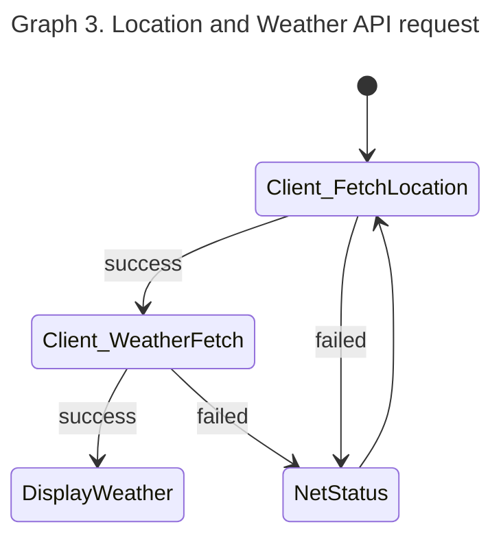

As for the other three API requests, they are linked due to the authentication required to access specific data of a Spotify user. See _Graph 4_.

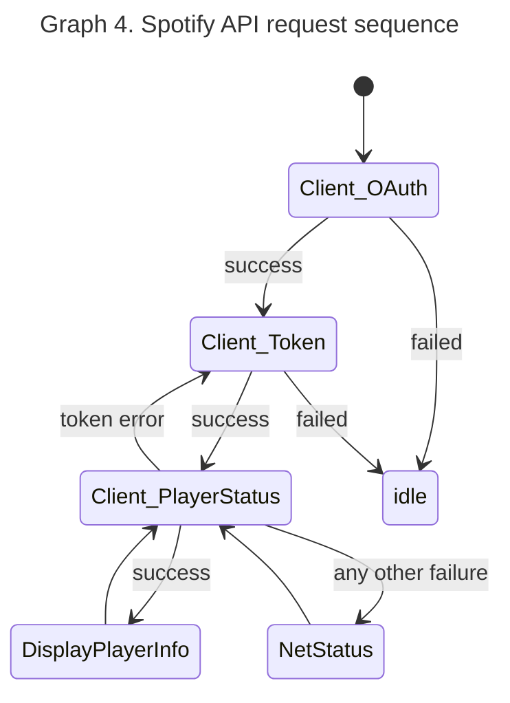

As seen from the two API-request clusters, all of them shared a common feature, which is a web client (establish a connection to a remote server, request a resource, process the arriving data, and terminate the connection). This is automated using an non-deterministic automaton, see _Graph 5_:

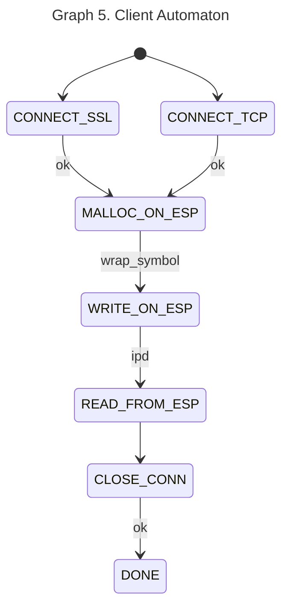

This is the same _Client_ seen in the _Network_ hierarchical state machine. The API-request clusters can configure this automaton through a data structure: URI, the connection type and a callback function that allows parsing and processing the requested data.  

### c. Server Automaton

On the other hand, two web servers were built, (1) the WiFi supplicant that allows the user to connect to any Access Point and (2) the Spotify Authenticator to link a Spotify account. These servers run in different modes of the WiFi module, when as a supplicant, the module works as SoftAP + station, so the user can join the WiFi network **Erika Weather**, browse to [http://192.168.4.1/](http://192.168.4.1) and set the SSID and password of the desired network and wait for connection. As Spotify Authenticator, recommended to use only when there's an internet connection (not tested when no connection), browse to [http://<the-esp8266-ip>/spotify](), and this provides the link that will authenticate the user's Spotify account and later it will automatically fetch the token.   

Similarly as client, a web server has a sequence: listen, accept client, serve resources, terminate connection and terminate server. This is also automated using a state machine, _Graph 6_ shows the description of it.

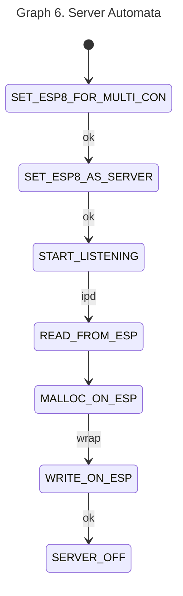

Same model as the client, each server can configure this server automaton, with what to serve, either a Wpa_supplicant or a Spotify authenticator.  

For both automata, the presented graphical diagrams are an abstract representation. There are so many intricacies that have been fine-tuned in code, conditions based on the remote sever response, data availability, unexpected terminated connections, error by buffering, timeouts on both server and WiFi module response.

### d. Initial_State Automaton

This automaton is simple, its description can be seen in _Graph 7_, it only sends commands for basic configuration and checking the device presence.

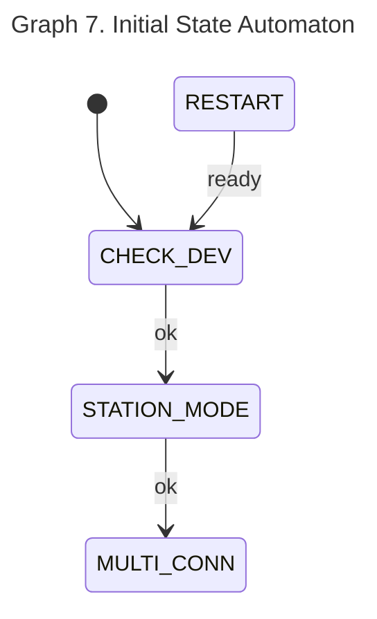

The state to remark is _RESTART_, that sends a restart command to the WiFi module in cases of:

- Unexpected server response (truncated responses).
- Timeout on command responses (128 calls of On_Hold).
- Many attempts (100) trying to get the local IP.

To clarify, this Automaton isn't running in parallel but it's invoked at the beginning and upon error occurrences.  

### e. NetStat Automaton

This automaton checks the network status, it is sequentially executed just after the _initial_state_ or when there's a connection error (e.g. sudden connection termination when the _Client_ automaton is active). This checks if the device has an IP, and if so, checks if there's an open connection and terminated if it's open.

 ```mermaid
 ---
 title: 'Graph 8. NetStat Automaton'
 ---
 stateDiagram-v2 
 [*] --> IFCONFIG
 IFCONFIG --> NETSTAT : ok
 IFCONFIG --> INITIAL_STATE.ESP8_RESTART : [attempts >= 100]
 IFCONFIG --> IFCONFIG: no-ip [attempts < 100]
 NETSTAT --> NETKILL : connection-open
 ```

---

### f. Implementation of Hierarchical states machines

Of course flattening a machine of this complexity is challenging and error prone and not scale-able once implemented. Thus, the approach taken was inspired by how _devices_ are represented in the Linux kernel:

``` c
int device = MKDEV(major, minor)
int major = MAJOR(dev)
int minor = MINOR(dev)
```

Thus a state can be formed as (code: _inc/state.h_):

``` c
uint16_t state = MKSTATE(super, sub);
uint16_t superstate = SUPERSTATE(state);	// parent state
uint16_t substate = SUBSTATE(state);		// child state
```

This limits the hierarchy to two levels only (father and child); Even though deeper levels of hierarchy weren't necessary for this project, I think using different number bits representation (uint8_t, uint32_t), deeper levels can be reached.


As for transitions, they were implemented using look-up-tables as well as switch statements, depending on the automaton's requirements: fully specified, guards, condition actions, entry actions.

Like the following piece of code, which is LUT for transition on the Initial_state when the WiFi module replies "OK", to any of the commands sent from its child states (sub-states), and depending on the active child states, it will transition to the its corresponding state. Here the advantage of how to initialise an array in _gcc_ is taken.

``` c
uint16_t LUT_OK_powerup(enum ESP8InitialSetup prev_subs) {
    uint16_t LUT[ESP8_INITIAL_SETUP_COUNT] = {
    [ESP8S_RESTART]     = MKSTATE(ESP8SS_ON_HOLD, 0),
    [ESP8S_CHECK_DEV]   = MKSTATE(ESP8SS_INITIAL_SETUP, ESP8S_STATION_MODE),
    [ESP8S_STATION_MODE]= MKSTATE(ESP8SS_INITIAL_SETUP, ESP8S_MULTI_CONN),
    [ESP8S_MULTI_CONN]  = MKSTATE(ESP8SS_NETSTATUS, 0),
    };

    if (prev_subs >= ESP8_INITIAL_SETUP_COUNT)
        return MKSTATE(ESP8SS_INITIAL_SETUP, ESP8S_RESTART);

    return LUT[prev_subs];
}
```

There are complex scenarios where the history superstate matters, e.g., when there's a connection error, the automaton quickly checks the network status and then back to the last active client or server, so nothing has to be restart again or waiting for a periodic task to be recall the client or server.

```c 
uint16_t LUT_OK_netstat(const enum ESP8NetManagerState superstate) {

    switch(esp8_status.wifi) {
    case WiFi_Ready:
    case TCP_UDP_Lost:
        switch(superstate) {
        case ESP8SS_NETSTATUS:  
        case ESP8SS_CLIENT:
            return MKSTATE(ESP8SS_CLIENT, ESP8S_CONNECT_TCP);

        default:
		   return MKSTATE(ESP8SS_INITIAL_SETUP, ESP8S_RESTART);
        }

    case TCP_UDP_Ready:
		return MKSTATE(ESP8SS_NETSTATUS, ESP8S_NETKILL);

    case WiFi_No_AP:
        return MKSTATE(ESP8SS_NETSTATUS, ESP8S_IFCONFIG);

	default:
        return MKSTATE(ESP8SS_INITIAL_SETUP, ESP8S_RESTART);
    }
}
```


## 4. ErikaOS

So far, the autamata that compose the system have been seen but these autmata have to be constantly called to check events that trigger the transitions, for such a purpose, 5 Erika tasks are used, as seen in the table below. 

| ID   | Taks Name         | Period  | Priority |
| ---- | ----------------- | ------- | -------- |
| 1    | Weather Update    | 10 mins | 1        |
| 2    | Spotify Update    | 2 s     | 2        |
| 3    | ESP82866 Poll     | 40 ms   | 1        |
| 4    | LCD In (touch)    | 20 ms   | 3        |
| 5    | Network Automaton | 80 ms   | 2        |


### T.1. Weather Update

Based on the OpenWeatherMap's [API doc](https://openweathermap.org/api/one-call-3) the data is updated every 10 minutes, so this task has a __10 minutes period__ that triggers an internal event invoking a change in the _Client Automaton_ of the task _Network_ to update the weather information, this closes the SSL connection (if open) for Spotify. 

_code: src/app.c_


### T.2. Spotify Update

Triggered each __2s__, it triggers an internal event that invokes a change in the _Client_ automaton of the task _Network_ in order to fetch the Spotify playback status.  Once the token is acquired, the automaton _network_ requests a SSL connection to [api.spotify.com:443](https://api.spotify.com) and it does not close it until a _weather update_ event asks for weather information. This link remains open due to establishing a SSL connection takes ~5 seconds on the ESP8266. Keep in mind that Spotify sends minimum 7Kbytes of HTTP data (1Kbyte: HTTP header + 6Kbyte: JSON) when a track is being played, note as well that there are songs that can reach 13Kbytes of meta data, transmitting these data and parsing it takes ~2 seconds. So, if the goal is to fetch the most recent information from the player open and closing the SSL connection is not the most suitable option; moreover, open and closing creates an overhead in the ESP8266 and in the Spotify's servers (which I don't think it's a big deal but if it were a smaller server, it would be a different story).

In order to reduce the amount of data coming from Spotify, the query request has being modified, so instead of being only:

```bash
GET api.spotify.com/v1/me/player/currently-playing
```

the available market was placed

```bash
GET api.spotify.com/v1/me/player/currently-playing?market=IT # IT stands for Italy
```

This request decreased the data size down to a minimum of ~4Kbytes (1KByte: HTTP Header + 3Kbyte: JSON).

Otherwise Spotify API replies with all the possible markets where that song and the album is available, which is a really long and unnecessary information. 

_code: src/app.c_


### T.3. ESP8266 Poll

Triggered each __40 ms__, parses the incoming data of the ESP8266. 40ms has being chosen because initially the circular buffer where the DMA is placing the incoming UART data was 1024 bytes size, and at 115200 bauds with 1 start bit and 1 end bit of the UART makes 10240 bits and the buffer will be full in 88ms, to avoid overlapping data, it's better to empty the buffer as soon as possible, so (by Nyquist) 40ms will do the job. 

That buffer dimension works perfect when fetching weather information because the data is smaller than 1Kbytes. It's a different story for Spotify where sometimes it throws 13Kbytes for a song. So, the initial buffer dimension isn't enough. But choosing a larger period will make other procedures slower, like when setting up the ESP8266, the used commands are averagely 14 bytes size (~1.2ms to transmit). So, the current mechanism does not try to empty the buffer but a balance between response time and HTTP content allocation, 90%-ish of the header is discarded , the only fields of interest are the _HTTP Method_, the _HTTP Status Code_ and the _Content-Length_. 

Right now the buffer size is 8Kbytes and 40ms works perfectly.

 _code: src/esp8266_driver.c_


### T.4. LCD In

Triggered each 20 ms, it checks if the LCD has being touched. An event-triggered filter was implemented in order to reduce the noise of the coordinates when the panel gets touched. The figure below shows the x-axis pixel coordinates upon touching the Spotify Icon button for 10.24 seconds (512 samples). As seen the x-axis data ranges from 200px to 280px,  falling only 211 samples within the icon's dimension (30x30 px) out of the 512 samples.

<br>

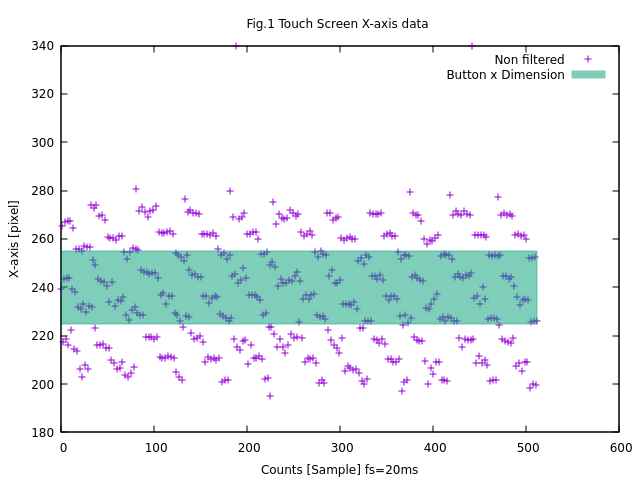
<br><br>

Some noise can be allowed whilst the double of standard deviation is as smaller as the button's dimension, in this case, a button covers 30x30 pixels and the standard deviations of the touchscreen are the followings for each axis:

$$
\sigma_x = 22.88px, \sigma_y = 3.98px
$$
Despite the Y-axis,  we can conclude that the x-axis does need to be filtered. The [application report](https://www.ti.com/lit/an/sbaa155a/sbaa155a.pdf?ts=1717523545771&ref_url=https%253A%252F%252Fwww.ti.com%252Fproduct%252FTSC2046E%253FkeyMatch%253DTSC2046EIRGVR%2526tisearch%253Dsearch-everything%2526usecase%253DOPN-ALT) by W. Fang lists 4 non-linear filters to deal with noise in resistive touchscreens:

  - Average with _N = 4_  samples.

  - Weighted Average with _N = 4_ samples and _M = 2_ (meaning drop 2 samples).

  - Middle Value with _N = 3_ samples.

  - Average the closest with _N = 3_ samples.

They were all tested using the raw data from the raw recorded data shown above and the results are shown in Fig.2. Two additional filters were explored, the [State Update Equation](https://www.kalmanfilter.net/alphabeta.html) _(1)_ with a fixed _alpha_ and another _(2)_ with _alpha(t)_ that depends on time:

$$
\hat{x} _{n,n}=\hat{x} _{n,n-1} + \alpha (z _n - \hat{x} _{n,n-1}) \space\space\space\space(1)
$$
and

$$
\hat{x} _{n,n} =\hat{x} _{n,n-1} + \alpha(t)(z _n - \hat{x} _{n,n-1}) \space\space\space\space(2)  
$$

$$
\alpha(t) = \alpha_1+\frac{\alpha_0-\alpha_1}{\sigma t + 1} | \alpha_0>\alpha_1>0  \land  \sigma > 0 \space\space\space(3)
$$


  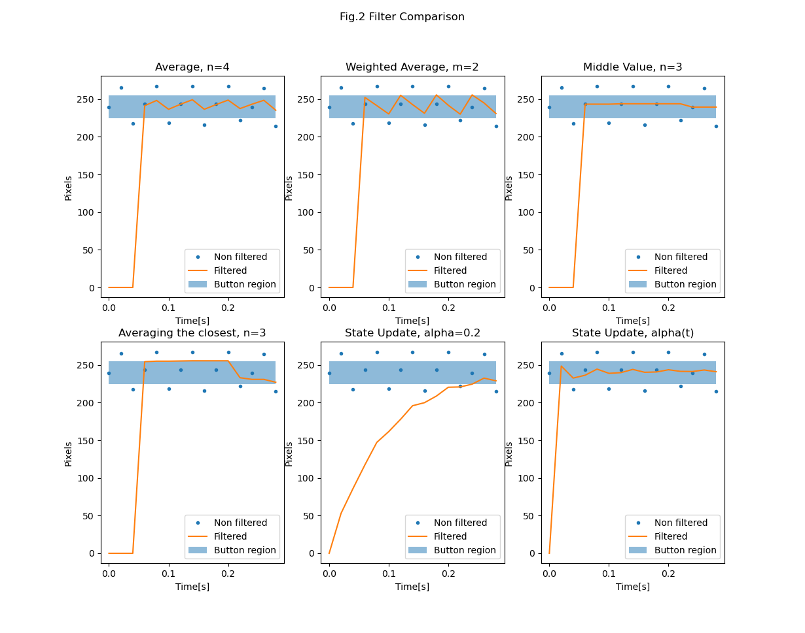

In Fig.2, only a small window frame of 250ms is shown because touching a button takes less than 1 second, so the purpose is to see which filter is the fastest one; since all filters kept the signal within the range of the button. Filters such as _Weighted Average_ and _Averaging the Closest_ are operating on the boundaries, therefore are suitable for this purpose. On the other hand _State Update_ is the slowest among all, discarded as well; however _State Update_ with _alpha(t)_ takes the signal to the button region in the second samples (20ms).

This _State Update Equation (2)_ with a variable _alpha_ is quite similar to a Kalman Filter, but, instead of _alpha_ depending on the variance of the process and the measure, it only leads _alpha_0_ to become _alpha_1_ at the rate of _sigma_ (_+1_ is to avoid division by zero). This is due that a large _alpha_ has a fast response but performs poorly at removing noise (used when touched) while a small _alpha_ performs good at removing noise but is really slow, so the idea behind it is to change _alpha_ over time so the signal reaches the desired level as soon as possible and then removes the noise.  This is implemented in a way that the _t_ gets resetted when there's a touch:

  ```c
    1 #define ALPHA10_X   5.799 // alpha1 - alpha0        
    2 #define ALPHA1_X    0.001
    3 #define SIGMA_X     260.0
    4 #define DELTA_T     0.02
    5
    6 static void state_update_extended(int *x, uint8_t *trigger) {
    7     static int16_t x_estimated = 0;
    8     static float t = 0.0;
    9     float alpha_x;
   10
   11     if (*trigger) {                 
   12         t = t + DELTA_T;
   13     } else {
   14         t = 0.0;     
   15         x_estimated = 0; 
   16     }
   17                     
   18     *trigger = 1;
   19
   20     alpha_x = ALPHA1_X + ALPHA10_X / (SIGMA_X * t + 1.0);   
   21     x_estimated = x_estimated + alpha_x * (*x - x_estimated);
   22     *x = (int) x_estimated;
   23 } 
  ```

$$
\alpha_0 = 5.8,\alpha_1 = 0.001, \sigma=260
$$

 

 ### T.5. Network

Triggered each 80ms, runs the web client or the web servers upon request of the previous tasks or external events as seen in the flow diagram on Fig.3. the external events are spotify_setup and wifi_setup, they are button in the touchscreen and are used to link a spotify account and to join to an Access Point respectively. On the other hand the internal events are generated by the tasks Weather Update and Spotify Update. 

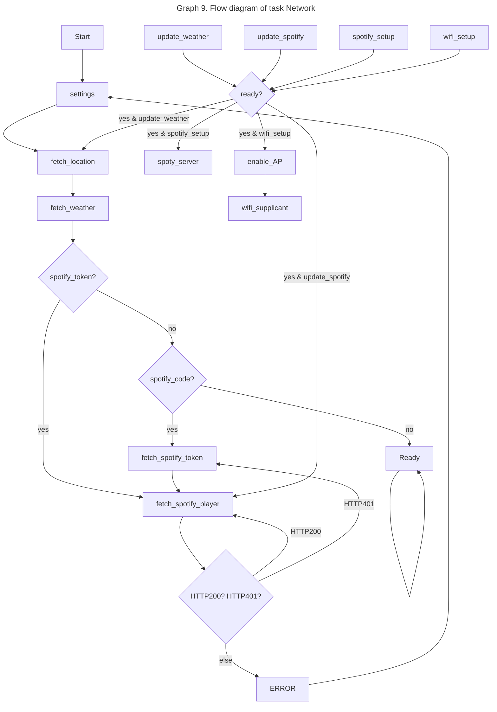

Even though _Graph 9_ shows the flow diagram of the app within network, the network task itself is an automaton that has been already detailed early above.

## 5. Unit Test

Using CUnit the following modules that are platform independent were test. The results of both registries can be found under the test file in the xml files, or it's possible to run them and generate the basic cunit testing results as follow:

``` bash
$ test/LUT_Test
$ test/ESP8266_Driver_Test
```

### a. Look-up Tables

A single suite in a single registry tested the following units:

LUT_OK_client, LUT_OK_initial_state, LUT_OK_timeout_initial_state, LUT_OK_on_error_initial_state, LUT_OK_netstat and, LUT_OK_server

It has been used a total of 103 asserts and the failure initially was due to the accessing the last element of in the LUTs (Segmentation Fault). It has been fixed simply by checking the incoming index of the transition.

Code example:

``` c
uint16_t LUT_OK_powerup(enum ESP8InitialSetup prev_subs) {
    uint16_t LUT[ESP8_INITIAL_SETUP_COUNT] = {
    [ESP8S_RESTART]     = MKSTATE(ESP8SS_ON_HOLD, 0),
    [ESP8S_CHECK_DEV]   = MKSTATE(ESP8SS_INITIAL_SETUP, ESP8S_STATION_MODE),
    [ESP8S_STATION_MODE]= MKSTATE(ESP8SS_INITIAL_SETUP, ESP8S_MULTI_CONN),
    [ESP8S_MULTI_CONN]  = MKSTATE(ESP8SS_NETSTATUS, 0),
    };

    return LUT[prev_subs];
}
```

Theoretically, there's no way that _prev_subs_ is larger than the LUT dimension, but if for any reason it exceeds, the LUT may return an unexpected state.

Solution:

```c
uint16_t LUT_OK_powerup(enum ESP8InitialSetup prev_subs) {
    /* Array initialization */
    
	if (prev_subs >= ESP8_INITIAL_SETUP_COUNT)
        return MKSTATE(ESP8SS_INITIAL_SETUP, ESP8S_RESTART);
    
    return LUT[prev_subs];
}
```


### b. ESP8266 driver

Two suites in a single registry has tested the following units with 55 asserts in total:

#### Suite 1:

**HTTP method extractor**, in order to determine if the HTTP arriving data is a requested method ("POST ..." and "GET ...") or a response ("HTTP/1.1 ...") by hashing them. In this case, the hash is simple, the first and fourth character of the arriving string are xor-ed. This also mean if there's a incoming method "PXXT " will be identified as a POST method; but, PXXT isn't part of the HTTP standard. So, for the supported POST, GET and HTTP/1.1 the tests were passed successfully.

**HTTP status code extractor**, the HTTP status code is composed with 3 characters, "1XX", "2XX", "4XX" and "5XX", it could have easier to use _atoi()_ for conversion; however, _atoi_ is generic and requires multiplication operations. So, in this case we hash those string as:

``` c
#define hash(str) 	((str[0] << 8) | \
					(str[1] & 0x0F) | \
					(str[2] & 0x0F))
// therefore
#define HTTP_404	hash("404"); // 13321 + 0 + 4 = 13316
#define HTTP_200	hash("200"); // 12800
```

7 simple operations are used and it gives us a unique identifier for the status code. All tests were passed with all used status code for this project: 200, 204, 401, 500, 520, 522.   

#### Suite 2:

**ESP8266 poll** 

Keep in mind that poll (that eventually calls the HTTP parser for HTTP method and HTTP status code) reads straight from the DMA buffer which is an incoming stream of bytes. Therefore, it's not as simple as having all the token strings all at once.

So, the poll identifies the response of the ESP8266 by matching the arriving characters with some expected tokens such as:

| token         | description                                               |
| ------------- | --------------------------------------------------------- |
| "\n>"         | Memory allocated in ESP8266 ready to receive data         |
| "IPD,"        | Incoming HTTP data (either from server or client)         |
| "ERROR"       | Error at any command sent                                 |
| "FAIL"        | Fail at any command sent                                  |
| "OK"          | Command sent was successfully processed                   |
| "ready"       | After starting up, the ESP8266 is ready for configuration |
| "STATUS:"     | Network Status                                            |
| "+CIPSTAT:ip" | Local IP of the ESP8266                                   |
| "X, CLOSED"   | Connection number X was closed                            |

Poll can be seen as an automaton as well:

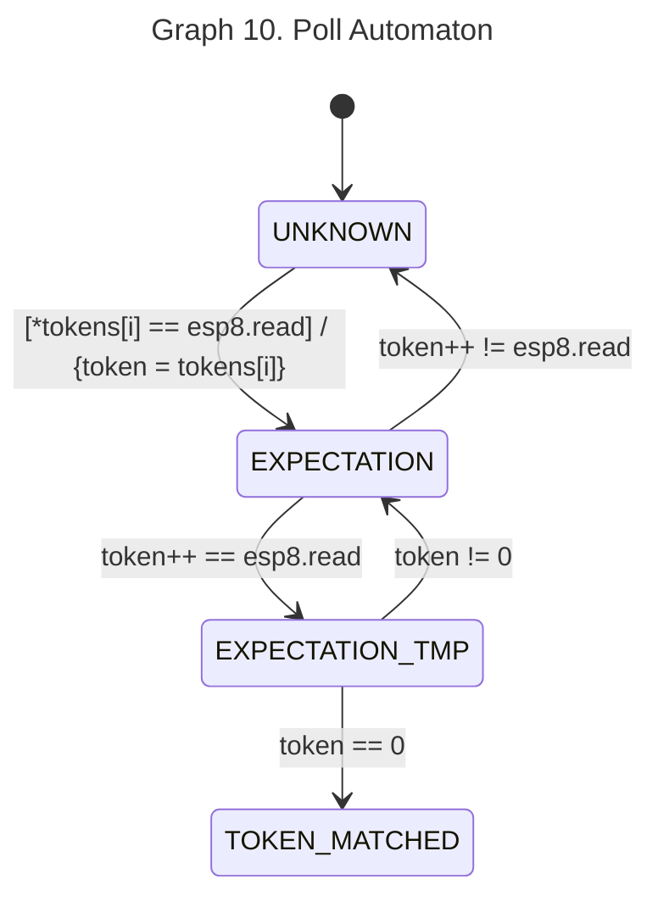

There are 4 conditions though:

1. All tokens need to start with by a different character, this is a limitation that wasn't a problem for the project itself but might be for other data streams.
2. An identifiable token cannot start with the NULL character.
3. An identifiable token length has minimum 2 characters.
4. The last Token in the list is NULL. therefore NULL is a key character.

Unlike the simple state machine description of _Graph 10_ for this automaton,  the implementation isn't simple, instead it's inspired by [strtok()](https://opensource.apple.com/source/Libc/Libc-167/string.subproj/strtok.c.auto.html) implementation.

In the Unit test, all tokens listed in the above token table were successfully identified.

## 6. Run and flash it

if the hardware is ready, The file _c_mX.bin_ can be flashed as follows:
``` bash
$ st-flash write c_mX.bin 0x8000000
```

### Compile

In order to recompile you need to download ERIKA2.x-OS from https://www.erika-enterprise.com/index.php/download/erika-v2.x.html. Once Erika is install, you only need the Erika-CLI not the whole Eclipse to work.

#### Step 1

Generate files from configuration file _conf.oil_ 

``` bash
$ ./erika-conf.sh conf.oil .
```

#### Step 3

You also need to install _gcc-arm-none-eabi_ and edit user.mk with the path directory where where the gcc-arm-none-eabi compiler is installed

``` bash
GNU_ARM_ROOT=/path/to/gcc-arm-none-eabi/compiler
```

## 7. Requirements
- ESP8266-IDF-ATV2.2.1 firmware
- Erika2.x OS (the operating system of the board)
- gcc-arm-none-eabi (to compile the project)
- stlink (to flash the board)

