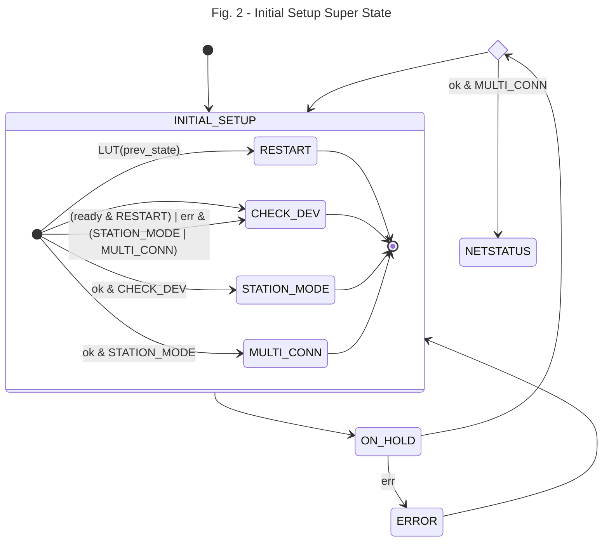
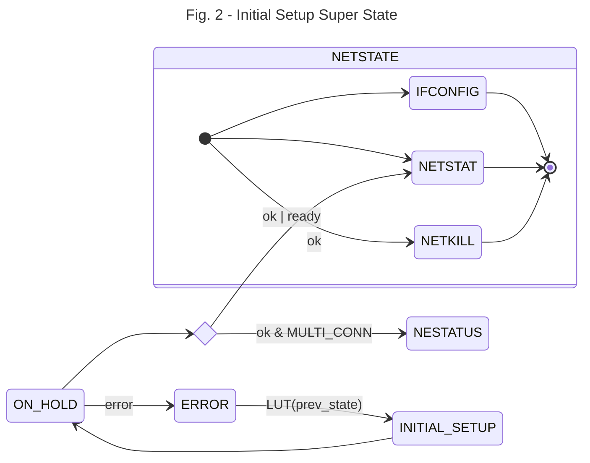

# ErikaOs-OnlineWeatherStation


It's a tiny monitor for you local weather and music player, meaning, it shows the current temperature, the feeling like temperature, the temperature description and the time of request, as for the music, the artist and track that are currently being played on your Spotify player (_disclaimer_: it does not play or pause the track). The weather information is fetched from [OpenWeatherMap.org](openweathermap.org) using location based on [IP-API.com](ip-api.com). In case of [Spotify](https://developer.spotify.com/), it fetches the code for the app and token (with refreshment once it's expired, 3600 s).

Two web servers were built as well, (1) the WiFi supplicant that allows the user to connect to any Access Point and (2) the Spotify Authenticator to link a Spotify account. These servers run in different modes of the WiFi module, when as a supplicant, the module works as SoftAP and station so, the user can join the WiFi network **Erika Weather**, browse to [http://192.168.4.1/](http://192.168.4.1) and set the SSID and password of the desired network and wait for connection. As Spotify Authenticator, recommended to use only when there's an internet connection and browse to [http://your-esp8266-ip/spotify](), this provides the link that will authenticate the user's Spotify account and later it will automatically fetch the token.   

You can skip this documentation and jump straight to the [compile](#Compile) section.

## Hardware 

The main board is a _STM32f407-discovery_ using _std_ library mounted over a _discover-more_ extension with and LCD _LCD35RT_. The secondary board is an ESP8266 that interfaces through UART in the COM1 (USART6 on the _discovery_ PC6-PC7 pins) on the _std_ library. ESP8266's reset/GPIO0/GIPO2/Enable pin are fixed voltage, meaning they are not connected to any STM32's GPIOS.

## Firmware

On the seconday board, ESP8266, the _ESP8266-IDF-ATV2.2.1.0_ is running, provided by Espressif, you can find in [this link](https://gist.github.com/ckevar/4275573daf5d2d4803346ab56bf4e0fe) how to install this firmware on the ESP8266. This firmware version is important in order to establish SSL connections, the ATv1.6.x supports SSL, but from tests, it's seen that [*.spotify.com:443]() is virtually hosted on Google, so the SSL uses SNI and the ATv1.6.x does not support SNI.

---

In the main board, the app was built based on ErikaRTOSv2, which is divided in 6 periodic tasks (code: _inc/erika_task_conf.h_): Weather Update, Spotify Update, ESP8266 Poll, LCD In and Network.

- __Weather Update__

  Based on the OpenWeatherMap's [API doc](https://openweathermap.org/api/one-call-3) the data is updated every 10 minutes , so this task has a __10 minutes period__ that triggers an internal event invoking a change in the client of the task _Network_ to update the weather information, this closes the SSL connection (if open) for Spotify. 

  _code: src/app.c_

    

- __Spotify Update__

  Triggered each __2s__, it triggers an internal event that invokes a change in the client of the task _Network_ in order to fetch the Spotify player information.  Once the token is acquired, the automaton on the STM32 requests a SSL connection to [api.spotify.com:443](https://api.spotify.com) and it does not close it until a _weather update_ event asks for weather information. This link remains open due to establishing a SSL connection takes ~5 seconds on the ESP8266. Keep in mind that Spotify sends minimum 7Kbytes of HTTP data (1Kbyte: HTTP header + 6Kbyte: JSON) when a track is being played and there are songs that can reach 13Kbytes, transmitting these data and parsing it takes ~2 seconds. So, if the goal is to fetch the most recent information from the player open and closing the SSL connection is not the most suitable option, moreover, open and closing creates an overhead in the ESP8266 and in the Spotify's servers (which I don't think it's a big deal but if it were a smaller server, it would be a different story).

  In order to reduce the amount of data coming from Spotify, we have modify the query request, so instead of being only:

  ```bash
  GET api.spotify.com/v1/me/player/currently-playing
  ```

  the available market was placed

  ```bash
  GET api.spotify.com/v1/me/player/currently-playing?market=IT # IT stands for Italy
  ```

  This request decreased the data size down to ~4Kbytes (1KByte: HTTP Header + 3Kbyte: JSON).

  _code: src/app.c_

  

- __ESP8266 Poll__

  Triggered each __40 ms__, parses the incoming data of the ESP8266. 40ms has being chosen because initially the circular buffer where the DMA is placing the incoming UART data was 1024 bytes size, and at 115200 bauds with 1 start bit  and 1 end bit on the UART, 10240 bits will fill the buffer in 88ms, to avoid overlapping data, it's better to empty it as soon as possible,  so (by Nyquist) 40ms will do the job. that buffer dimension works perfect when fetching weather information because the data barely reaches 1Kbytes. It's a different story for Spotify where sometimes it throws 13Kbytes for a song. So, the initial buffer dimension isn't enough. But choosing a larger period will make other processes slowly, like when setting up the ESP8266, the used commands are averagely 14 bytes size (~1.2ms to transmit). So, the current mechanism does not try to empty the buffer but just wait for the content of the HTTP, the header is almost discarded, the only fields of interest are the _HTTP Method_, the _HTTP Status Code_ and the _Content-Length_. Right now the buffer size is 8Kbytes and 40ms works perfectly.

   _code: src/esp8266_driver.c_

- __LCD In__

  Triggered each 20 ms, it checks if the LCD has being touched. An event-triggered filter was implemented in order to reduce the noise of the coordinates when the panel gets touched. The figure Fig.1 shows the x axis pixels upon touching the Spotify Icon button for 10.24 seconds (512 samples). As seen the x-axis data ranges from 200px to 280px,  falling only 211 samples  within the icon's dimension out of 512 samples.

  

  Some noise can be allowed whilst the double of standard deviation is as smaller as the button's dimension, in this case a button covers 30x30 pixels and the standard deviations of the touchscreen are the followings for each axis:
  $$\sigma_x = 22.88px, \sigma_y = 3.98px$$
  Y-axis doesn't need a filter as long as the touched coordinate is close to centre of the button, while the x-axis does need to be filtered.

  There's an [application report](https://www.ti.com/lit/an/sbaa155a/sbaa155a.pdf?ts=1717523545771&ref_url=https%253A%252F%252Fwww.ti.com%252Fproduct%252FTSC2046E%253FkeyMatch%253DTSC2046EIRGVR%2526tisearch%253Dsearch-everything%2526usecase%253DOPN-ALT) by W. Fang where 4 non linear filters are suggested for resistive touchscreens: 

  - Average with _N = 4_  samples.

  - Weighted Average with _N = 4_ samples and _M = 2_ (meaning it drops 2 samples).

  - Middle Value with _N = 3_ samples.

  - Average the closest with _N = 3_ samples.

  They were all tested using the raw data from Fig.1 and the results are shown in Fig.2. Two additional filteres were explored, the [State Update Equation](https://www.kalmanfilter.net/alphabeta.html) with a fixed $\alpha$ and another with $\alpha(t)$:
  
  $$\hat{x}_{n,n} =\hat{x}_{n,n-1} + \alpha(z_n-\hat{x}_{n,n-1})   (1)$$
   and
  $$\hat{x}_{n,n} =\hat{x}_{n,n-1} + \alpha(t)(z_n-\hat{x}_{n,n-1})$$
  $$\alpha(t) = \alpha_1+\frac{\alpha_0-\alpha_1}{\sigma t + 1}$$
  

  

- __Network__, triggered each 80ms, runs the web client or the web servers upon request of the previous tasks.

  The ESP8266 (ESP8) works on request of AT commands, a host sends a command such as: 

  ```
  Host: AT+CWMODE=3\r\n
  ESP8: AT+CWMODE=3\r\n
  ESP8: \r\n
  ESP8: OK\r\n
  ```

  







 ## Future Improvements

1.  Not close the SSL connection with Spotify, it takes 5 seconds.

## How to run/flash it
if the hardware is ready, The file _c_mX.bin_ can be flashed as follows:
``` bash
$ st-flash write c_mX.bin 0x8000000
```

## Compile
In order to recompile you need to download ERIKA2.x-OS from https://www.erika-enterprise.com/index.php/download/erika-v2.x.html
Once Erika is intall, you only need the Erika-CLI not the whole Eclipse to work. So, everything usefull executable you need is under the _evidence_ folder.

### Step 1
Generate files from configuration file _conf.oil_ 

``` bash
$ erika-gen /path/where/Erika-CLI/is/installed/Erika-CLI/ conf.oil .
```

### step 1
add _usr.mk_ inside makefile

``` bash
$ nano makefile
```
in the first line write:

``` bash
$ include usr.mk
```
## step 3
You also need to install _gcc-arm-none-eabi_.
Edit usr.mk, to address where the gcc-arm-none-eabi compiler is installed
``` bash
$ nano usr.mk
```

Locate the line that starts with _GNU_ARM_ROOT_ and change it by the path where your compiler is installed.

## Requirements
- ESP8266-IDF-ATV2.2.1 firmware
- Erika2.x OS (the operating system of the board)
- gcc-arm-none-eabi (to compile the project)
- stlink (to flash the board)

